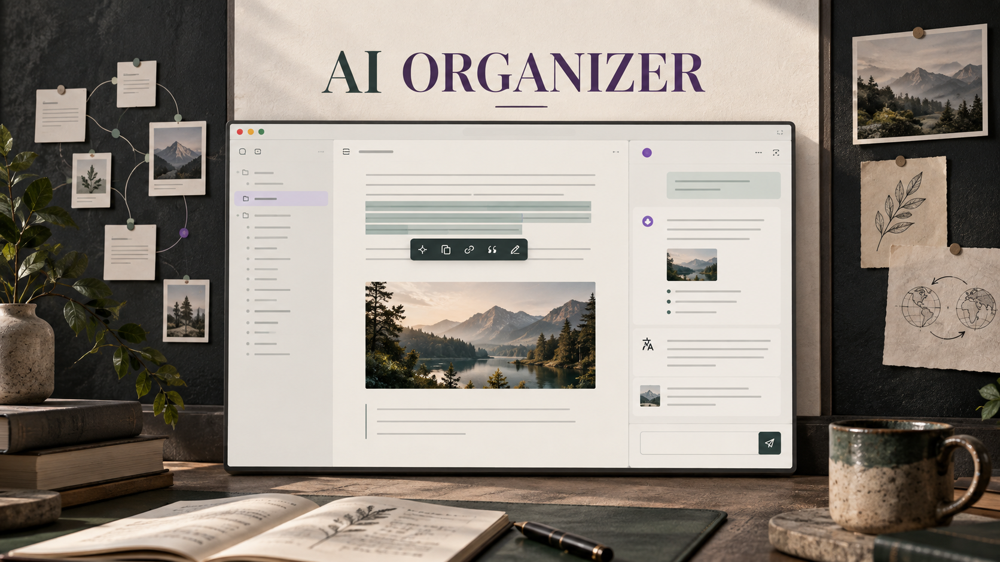
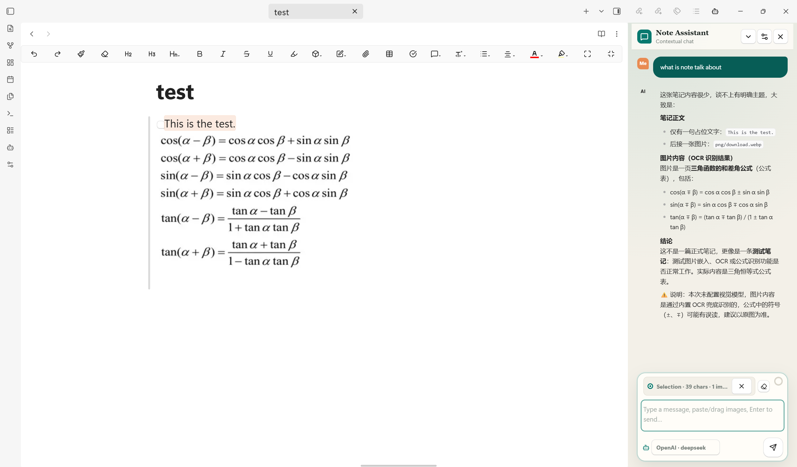
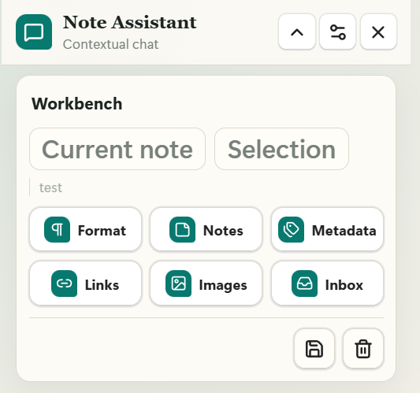
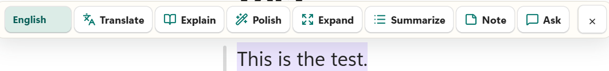
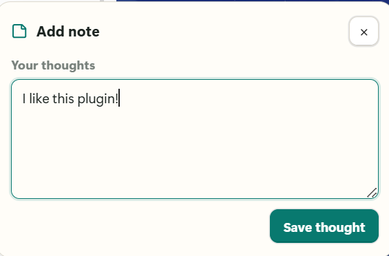
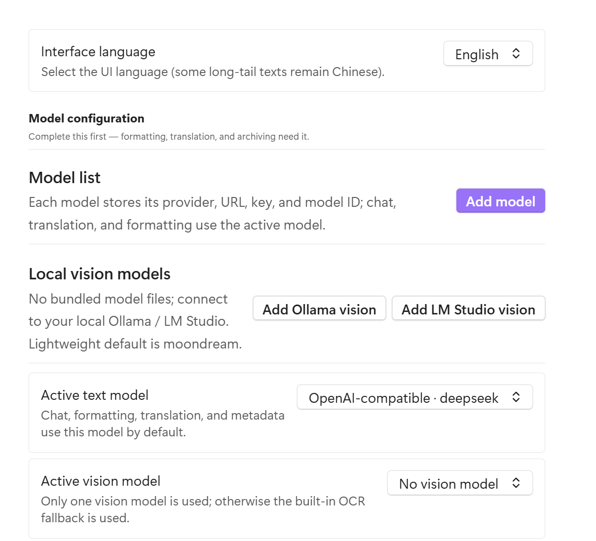
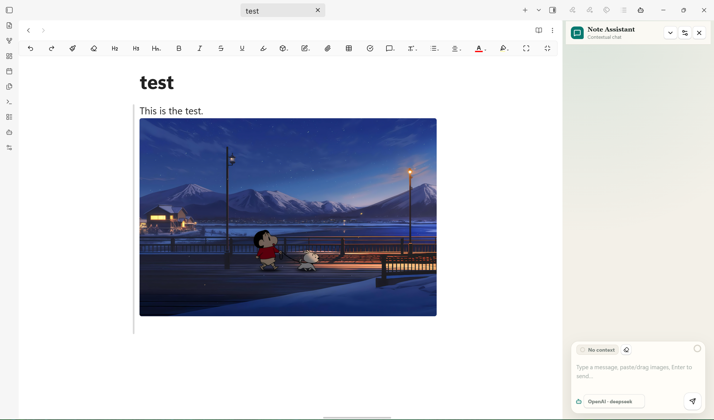
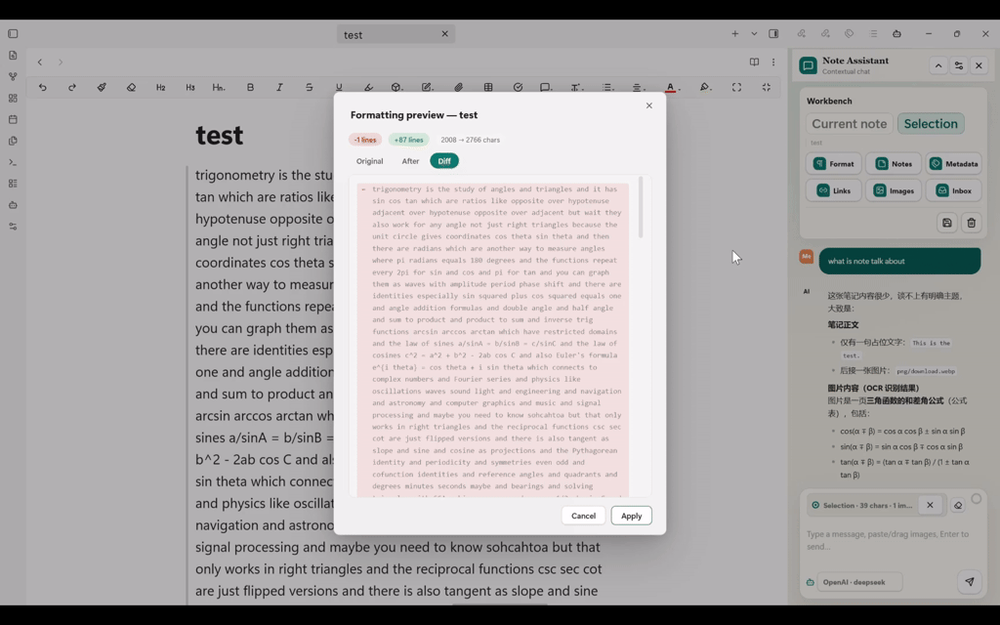

<div align="center">

# AI Organizer for Obsidian

**A note-aware AI workspace for writing, reading, image understanding, and knowledge-base maintenance.**

<p>
  <a href="https://obsidian.md/plugins?id=ai-organizer"></a>
  <a href="https://github.com/Pitkil/obsidian-AI-organization-plugin/releases"></a>
  
  <a href="LICENSE"></a>
</p>

<p>
  <a href="#why-ai-organizer">Why AI Organizer</a> ·
  <a href="#interface">Interface</a> ·
  <a href="#installation">Installation</a> ·
  <a href="#configuration">Configuration</a> ·
  <a href="#feature-reference">Feature Reference</a> ·
  <a href="#privacy-and-limits">Privacy</a>
</p>

<p><strong>English</strong> · <a href="README.zh-CN.md">简体中文</a></p>



</div>

AI Organizer brings AI into the note itself. Select a passage to translate or rewrite it, ask questions with the current note and its images as context, keep anchored reading notes outside the Markdown body, and maintain a vault with formatting, metadata, links, inbox, attachment, and batch tools.

It supports remote APIs and local OpenAI-compatible services. Text and vision models are configured separately, while built-in OCR provides a fallback when a vision model is unavailable.

## Why AI Organizer

| | Capability | What it gives you |
| --- | --- | --- |
| **Write** | Selection actions | Translate, explain, polish, expand, summarize, annotate, or ask about selected text without leaving the editor. |
| **Translate** | Review-first translation | Choose the target language at any time, use a dedicated small model, then copy, replace, or save the result as an annotation. |
| **Think** | Anchored annotations | Save translations, thoughts, questions, and TODOs outside the Markdown body while keeping a visible anchor beside the original passage. |
| **Chat** | Real note context | Chat with the current note, a selection, referenced note images, pasted or dropped images, and recent conversation history. |
| **See** | Vision plus OCR | Use a selected vision model for visual understanding; fall back to built-in OCR to extract visible text for the text model. |
| **Control** | Independent model profiles | Give every model its own provider, URL, API key, model ID, role, context window, temperature, and output limit. |
| **Customize** | Editable prompts | Define the chat system prompt and create reusable formatting Prompt templates that appear as formatting modes. |
| **Review** | Safe formatting | Compare Original, After, and Diff views. Empty, suspiciously short, or image-dropping results are blocked before writing. |
| **Organize** | Vault maintenance | Organize images, rewrite links, archive orphan attachments, generate frontmatter, sort an inbox, suggest links, and process notes in batches. |
| **Focus** | Compact workspace | Collapse the workbench, see active context and estimated usage, switch only between configured models, and restore chat or reading position. |
| **Language** | Bilingual interface | Switch the plugin interface between Chinese and English from settings. |

## Interface

### Context that follows your work

The sidebar can use the whole note or a stable selection snapshot. It resolves images referenced by that context, analyzes them through the active vision model or OCR fallback, and passes a concise result to the text model. The ring beside the composer estimates usage against the context-window value configured for the active model.

<p align="center">
  
</p>

### A workbench that gets out of the way

The workbench groups note-level actions without permanently taking conversation space. Collapse it when you only need chat; expand it for formatting, annotations, metadata, links, image organization, and inbox review.

<p align="center">
  <br>
  <sub>Collapsible note workbench</sub>
</p>

Select text in the editor and the actions appear beside the passage. Translation language is available directly in the toolbar, while the remaining actions stay one click away.

<p align="center">
  <br>
  <sub>Translate, explain, polish, expand, summarize, annotate, or ask</sub>
</p>

### Notes attached to the passage, not inserted into it

Annotations are stored in plugin data instead of being appended to the Markdown body. Write your own thought or save a translation, then return to the marked passage later. Annotations can be edited, deleted, located, and exported.

<p align="center">
  <br>
  <sub>Write a thought, question, or TODO</sub>
</p>

<p align="center">
  <br>
  <sub>A lightweight anchor marks the source passage</sub>
</p>

### Models are profiles, not global credentials

Each profile carries its own endpoint and key. Keep several text or vision models, select one active text model and one active vision model, and route translation to a smaller dedicated text model when desired.

<p align="center">
  
</p>

### Images are part of the note context

Paste or drag images into chat, or let AI Organizer discover images referenced by the current note or selection. Limits for image count and file size are configurable per request; they do not limit how many images a document may contain.

<p align="center">
  
</p>

### Formatting stays reviewable

Formatting runs in a non-blocking workflow and opens a dedicated review window when the model finishes. Compare the original, formatted result, and diff before applying the change.

<p align="center">
  
</p>

## Installation

### Obsidian Community Plugins

1. Open `Settings -> Community plugins` in Obsidian.
2. Select `Browse` and search for **AI Organizer**.
3. Select `Install`, then `Enable`.

You can also open the [AI Organizer plugin page](https://obsidian.md/plugins?id=ai-organizer) directly.

### BRAT

Install [BRAT](https://github.com/TfTHacker/obsidian42-brat), choose `Add a beta plugin for testing`, and enter:

```text
Pitkil/obsidian-AI-organization-plugin
```

### Manual installation

Download `main.js`, `manifest.json`, and `styles.css` from the latest [release](https://github.com/Pitkil/obsidian-AI-organization-plugin/releases), then place them in:

```text
<your-vault>/.obsidian/plugins/ai-organizer/
```

Reload Obsidian and enable **AI Organizer** under Community plugins.

## Configuration

Open `Settings -> AI Organizer`. Configure at least one usable text-model profile before using chat or AI tools.

### Model profiles

| Setting | Purpose |
| --- | --- |
| Display name | Name shown in the chat model picker. |
| Use | Marks the profile as a text or vision model. |
| Provider | OpenAI-compatible, Anthropic Claude, or Google Gemini. |
| Base URL | Independent endpoint for this profile; useful for proxies, Ollama, LM Studio, vLLM, and third-party APIs. |
| API key | Stored separately for each profile. Local loopback endpoints may leave it blank. |
| Model ID | Exact model name sent to the provider. |
| Context window | Drives the context-usage estimate shown in chat. |
| Temperature / max tokens | Controls generation behavior and output length. |

OpenAI-compatible profiles work with OpenAI, DeepSeek, Qwen, GLM, Kimi, Ollama, LM Studio, vLLM, and other services that expose a compatible chat-completions API. Dedicated adapters are included for Anthropic Claude and Google Gemini.

### Text, vision, and OCR

- The active **text model** handles chat, writing, translation, formatting, metadata, inbox classification, and link suggestions.
- The active **vision model** handles note images and chat image attachments. Only the selected vision profile is used for a request.
- Quick profile presets are available for local Ollama and LM Studio vision endpoints; no vision-model weights are bundled with the plugin.
- When no vision model is configured or its request fails, the built-in `tesseract.js` path extracts visible text and passes it to the text model.
- OCR is a text-extraction fallback, not a replacement for visual reasoning. Formulae, layouts, charts, and photographs are better handled by a vision model.

### Prompt customization

AI Organizer exposes two practical prompt layers:

1. **Chat system prompt** controls the assistant's default role, language, tone, and response style.
2. **Formatting Prompt templates** let you save named formatting instructions, edit or remove them, and select them as the default formatting mode.

Built-in formatting modes remain available for full formatting, Markdown syntax, heading structure, and CJK/English spacing and punctuation.

### Translation

Set a default target language, maintain a list of frequently used target languages, and optionally choose a dedicated fast or inexpensive text model. If no translation model is selected, the active text model is used.

## Feature Reference

### Selection workflow

| Action | Behavior |
| --- | --- |
| Translate | Opens a review popover with language switching, copy, replace, and annotation actions. |
| Explain | Explains the selected passage without replacing it. |
| Polish | Rewrites the selection while preserving its meaning. |
| Expand | Adds useful detail to the selection. |
| Summarize | Condenses the selection into key points. |
| Note | Saves your own thought, question, or TODO as an anchored annotation. |
| Ask | Moves the selection into chat context for follow-up questions. |

Applied text edits are briefly highlighted and expose an undo action. Obsidian's normal undo history remains available.

### Chat and context

- Toggle current-note and selection context independently.
- Paste or drag image attachments into the composer.
- Stream model responses and stop generation.
- Switch between configured, usable text-model profiles below the input.
- Estimate context use from the note or selection, history, current input, images, and the model's configured context window.
- Restore recent conversation history after reopening the sidebar.
- Save a conversation as Markdown or clear current history.
- Collapse the workbench to preserve conversation space.

### Formatting and organization

| Tool | What it does |
| --- | --- |
| Formatting | Runs a built-in mode or custom Prompt template, then presents Original, After, and Diff views before applying. |
| Image organization | Moves referenced images into a chosen folder, optionally renames them, and rewrites Wiki and Markdown image links. |
| Orphan scan | Moves unreferenced attachments into an archive folder instead of deleting them. |
| Metadata | Generates configurable tags, summary, and aliases in frontmatter. |
| Inbox | Reviews AI-proposed destination folders before moving inbox notes; optional folder creation is supported. |
| Link suggestions | Reviews related-note candidates and inserts accepted links into the note. |
| Batch processing | Runs formatting, metadata generation, or translation across selected notes with a configurable request delay. |
| Reading position | Restores the saved scroll and cursor position when a note is reopened. |

### Commands

| Command | Description |
| --- | --- |
| Open AI chat panel | Open or focus the sidebar. |
| Close AI chat sidebar | Close the AI Organizer view. |
| Open AI Organizer settings | Open plugin settings. |
| Restore last reading position | Return to the active note's recorded position. |
| Format active note with AI | Format the note and open the preview. |
| Organize images in active note | Move images and rewrite their links. |
| Scan orphan attachments | Find and archive unused attachments. |
| Generate tags, summary, and aliases | Generate frontmatter metadata. |
| Organize inbox intelligently | Review and apply inbox destinations. |
| Suggest related notes | Review and insert related-note links. |
| Batch AI processing | Process multiple selected notes. |
| Translate selected text | Open translation for the current selection. |
| Edit selected text | Polish, expand, continue, or compress the current selection. |
| Export current note annotations | Export annotations from the active note to Markdown. |

## Privacy and Limits

- AI actions run only when you trigger them. Depending on the operation, the plugin may read the active note, selected text, referenced images, candidate note titles, or attachment paths.
- Content sent to a remote provider is governed by that provider's terms. Local Ollama or LM Studio endpoints can keep model requests on your machine or local network.
- API keys are stored in Obsidian's plugin data. They are not encrypted by AI Organizer; protect and sync that data accordingly.
- OCR uses `tesseract.js`. Required runtime or language data may need to be obtained and cached before local recognition can run.
- Long note content is truncated before requests. Image limits are configurable from 1–200 images and 1–50 MB per image; defaults are 20 images and 5 MB.
- The context ring is an estimate, not provider billing data. It uses the configured context-window size and approximate token counts.
- Annotation records live in plugin data. Sync plugin data if you expect the same annotations on multiple devices.
- Review generated edits, metadata, links, and file-move suggestions before applying them to important vaults.

## Development

```bash
npm install
npm run dev
npm run build
npm test
```

| Script | Description |
| --- | --- |
| `npm run dev` | Watch source files and rebuild during development. |
| `npm run build` | Type-check and bundle the plugin into `main.js`. |
| `npm test` | Run the Vitest suite. |
| `npm run test:watch` | Run tests in watch mode. |

```text
src/
├── main.ts          Plugin lifecycle, commands, editor interactions
├── settings.ts      Persisted settings, defaults, migration
├── providers/       OpenAI-compatible, Claude, Gemini
├── core/            Chat, formatting, OCR, images, metadata, inbox, links
├── ui/              Sidebar, settings, review and workflow modals
└── utils/           Position, Markdown, notification helpers
```

## Contributing

Issues and focused pull requests are welcome. Please describe the user workflow being changed, keep unrelated refactors separate, and run `npm run build` plus `npm test` before submitting.

## License

[MIT](LICENSE) © [Wang Yilai](https://github.com/Pitkil)
