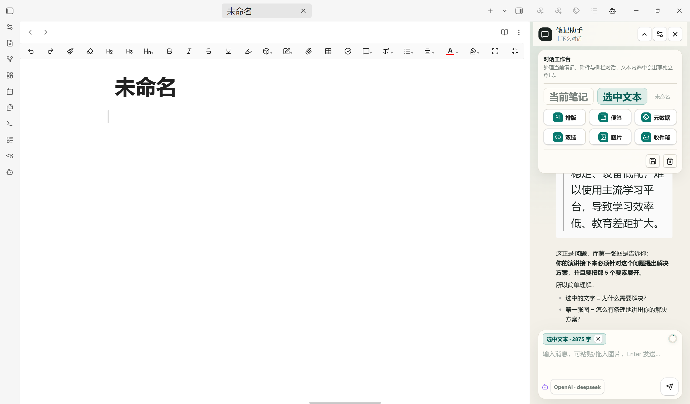
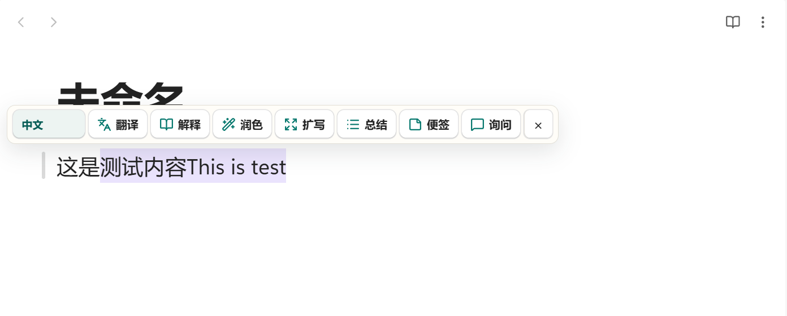
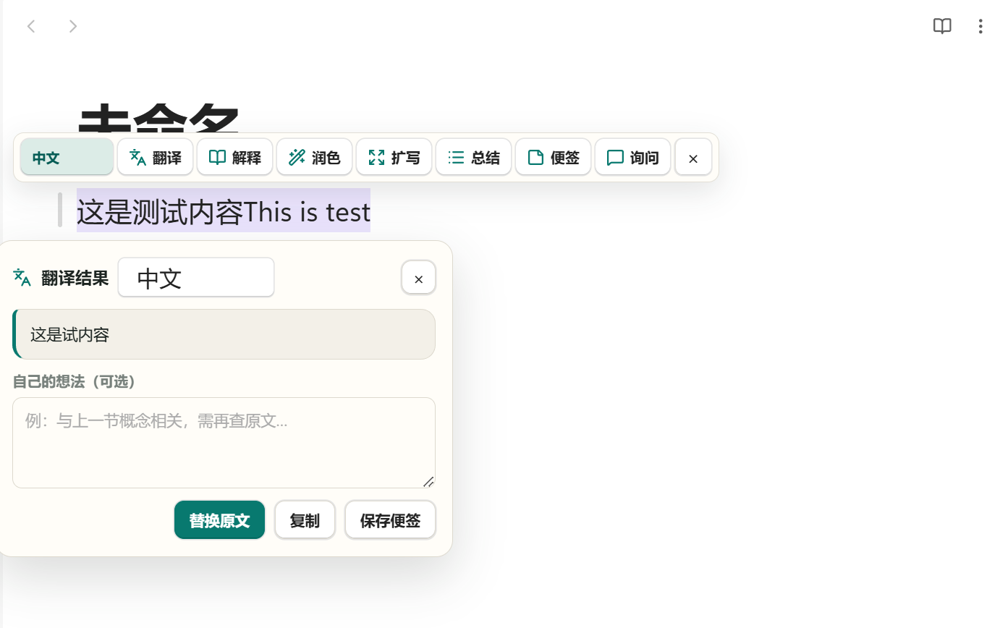
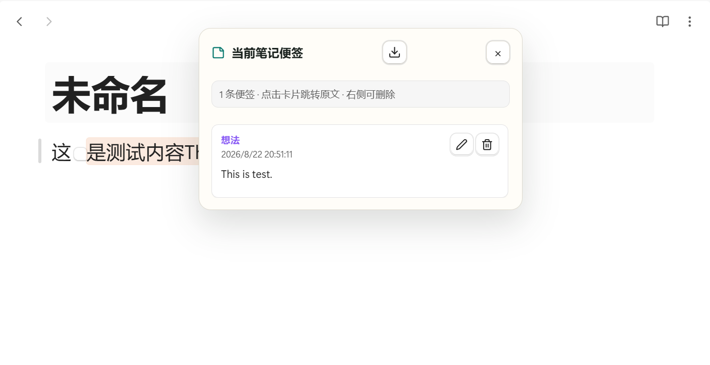
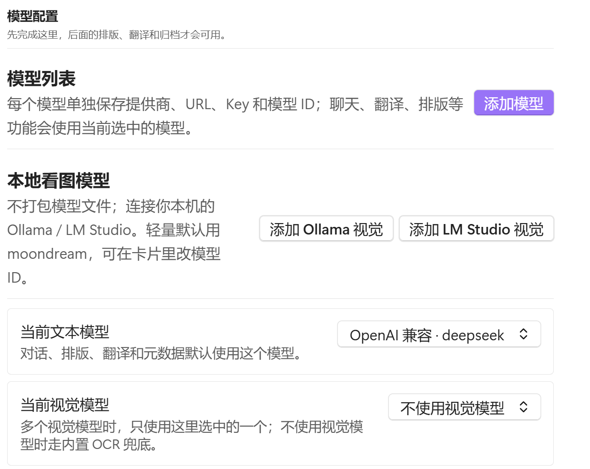
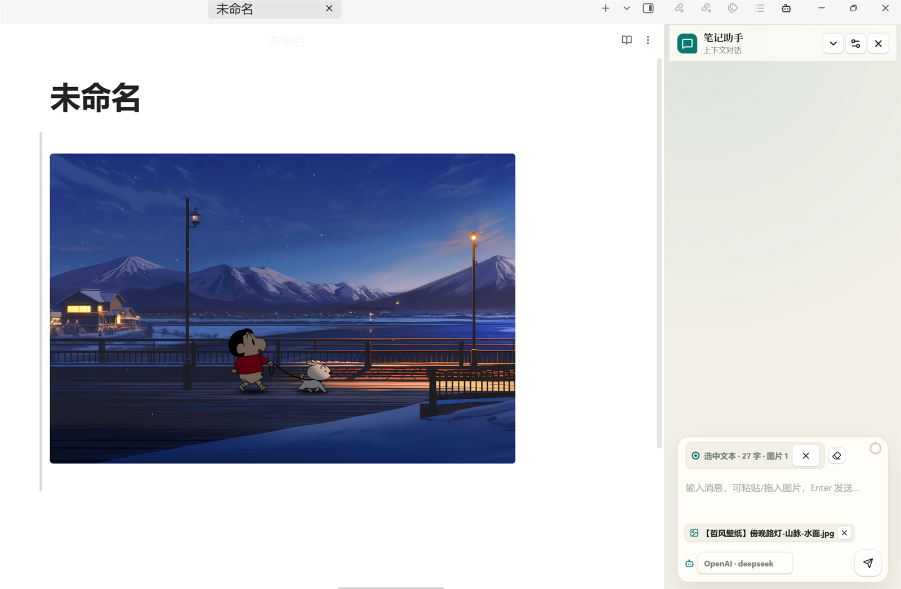
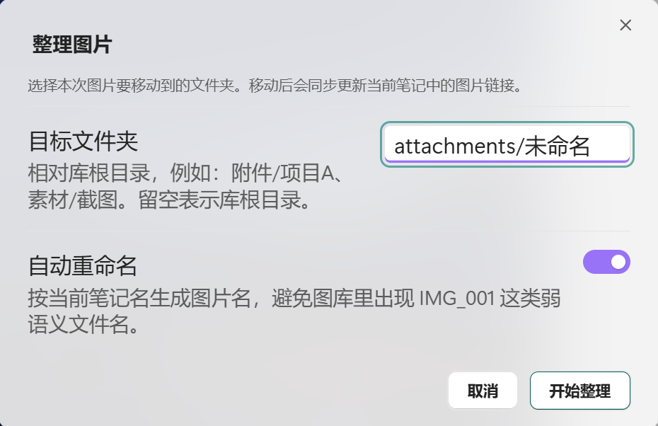
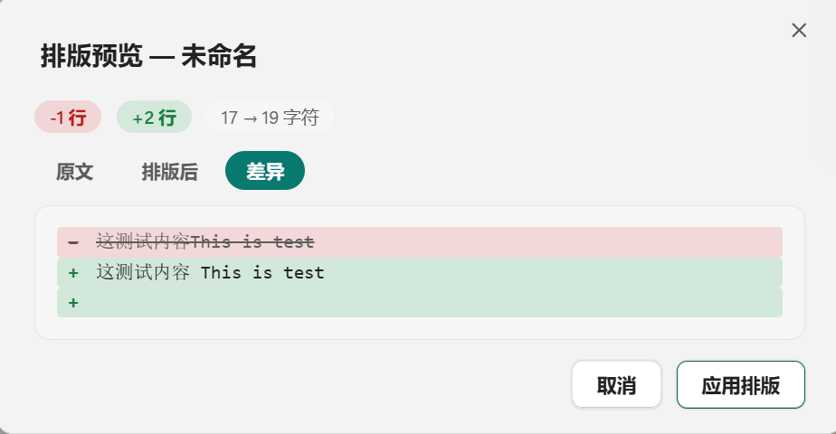

<div align="center">

# Obsidian AI Organizer

**面向 Obsidian 的一站式 AI 工作台** —— 上下文对话、选中文本处理、翻译、OCR 辅助图片理解、智能排版、附件整理、Zotero 式便签、元数据生成、收件箱自动归类、双链建议与批量处理，全部融入你的笔记流程。

<p>
  
  
  
  
  
</p>

<p>
  <a href="#功能特性">功能特性</a>
  ·
  <a href="#界面截图">界面截图</a>
  ·
  <a href="#安装方法">安装方法</a>
  ·
  <a href="#模型配置">模型配置</a>
  ·
  <a href="#使用说明">使用说明</a>
  ·
  <a href="#命令列表">命令列表</a>
</p>

<p>
  <strong>🌐 语言</strong>：
  <a href="README.md">English</a>
  ·
  <a href="README.zh-CN.md"><strong>中文</strong></a>
</p>

</div>

---

### 📦 仓库说明

| | |
| --- | --- |
| **GitHub 仓库** | [Pitkil/obsidian-AI-organization-plugin](https://github.com/Pitkil/obsidian-AI-organization-plugin) |
| **Obsidian 插件页** | <https://obsidian.md/plugins?id=ai-organizer> |
| **Obsidian 社区插件** | `设置 → 第三方插件 → 浏览 → 搜索 "AI Organizer"` |
| **通过 BRAT 安装** | `Obsidian://brat?plugin=Pitkil/obsidian-AI-organization-plugin` |
| **发行版下载** | <https://github.com/Pitkil/obsidian-AI-organization-plugin/releases> |
| **问题反馈** | <https://github.com/Pitkil/obsidian-AI-organization-plugin/issues> |
| **作者** | [Wang Yilai](https://github.com/Pitkil) |

> 📌 **还没上架官方市场？** 可以先用上方链接手动安装，或通过 [BRAT](https://github.com/TfTHacker/obsidian42-brat) 安装。详细步骤见 [安装方法](#安装方法)。

---

<p align="center">
  
</p>

AI Organizer 面向经常在长笔记和知识库中工作的人。它不把每项任务都塞进独立的聊天机器人，而是让你在 Obsidian 内直接处理选中文本、围绕当前笔记提问、解析图片、保留阅读批注、整理附件，无需切换工具。

## 功能特性

| 功能 | 说明 |
| --- | --- |
| 多模型 Profile | 可配置多个模型 Profile，每个独立设置提供商、Base URL、API Key、模型 ID、模型类型、上下文窗口、温度和最大 Token。 |
| 文本 / 视觉模型分离 | 写作类任务使用文本模型；图片感知对话可单独指定视觉模型。 |
| OpenAI 兼容接口 | 支持 OpenAI、DeepSeek、通义千问、智谱 GLM、Kimi、Ollama、LM Studio、vLLM 等兼容服务。 |
| 选中文本工具栏 | 在编辑器中选中文字后，可翻译、解释、润色、扩写、总结、添加便签或放入对话上下文。 |
| 翻译结果小窗 | 替换原文、复制结果或保存为便签前，先在小窗中审阅翻译。 |
| Zotero 式便签 | 阅读笔记、想法、疑问和翻译便签作为插件批注保存，不直接写入 Markdown 正文，并在编辑器中保留轻量锚点。 |
| 上下文对话侧边栏 | 结合当前笔记、选中文本、粘贴图片、笔记内图片与历史消息进行对话。 |
| 上下文占用仪表 | 发送前估算当前模型上下文已使用比例。 |
| 图片理解 | 通过已配置的视觉模型读取笔记或对话附件中的图片；视觉模型不可用时自动走 OCR 兜底。 |
| 智能排版 | 长 Markdown 笔记排版前提供预览、差异视图与安全检查。 |
| 图片整理 | 将引用的图片移动到指定目录，并自动重写 Wiki 链接与 Markdown 图片链接。 |
| 元数据生成 | 为当前笔记生成 frontmatter 标签、摘要与别名。 |
| 收件箱整理 | 移动文件前先审阅 AI 为收件箱笔记推荐的目标目录。 |
| 双链建议 | 推荐相关笔记并写入"相关笔记"区块。 |
| 批量处理 | 对多篇笔记批量执行排版、元数据或翻译，支持请求间隔控制。 |
| 浏览位置记忆 | 重新打开笔记时自动回到上次的滚动位置。 |
| 中英双语界面 | 设置页顶部可切换中文 / English 界面语言。 |

## 界面截图

### 对话工作台

对话侧边栏能理解当前笔记、选中文本、图片附件与已配置的模型 Profile；工作台可收纳，让对话保持专注。

<p align="center">
  
</p>

### 选中文本工具栏

编辑器中选中文字后，工具栏浮现在文本附近，提供阅读与编辑场景下常用的操作。

<p align="center">
  
</p>

### 翻译结果小窗

翻译结果在小型审阅面板中展示，可替换原文、复制结果，或把翻译与自己的想法保存为便签。

<p align="center">
  
</p>

### 便签（批注）

便签由插件保存，而不是写进 Markdown 正文；支持编辑、删除、定位与导出。

<p align="center">
  
</p>

### 模型设置

每个模型 Profile 独立配置，可定义文本模型与视觉模型，包括本地 OpenAI 兼容服务。

<p align="center">
  
</p>

### 图片上下文

当笔记或选中文本包含图片时，AI Organizer 会将其传给选中的视觉模型；若失败或未配置视觉模型，OCR 可提取图中文字供文本模型理解。

<p align="center">
  
</p>

### 图片整理

每次整理可选择目标文件夹，并决定是否为当前笔记重命名图片。

<p align="center">
  
</p>

### 排版预览

排版结果写入笔记前会先审阅。插件会拦截空内容、异常偏短或丢失图片引用的结果。

<p align="center">
  
</p>

## 安装方法

### 方式一：官方社区插件市场

1. 打开 Obsidian，进入 `设置 → 第三方插件`。
2. 若开启"受限模式"，请先关闭。
3. 点击 `浏览`，搜索 **AI Organizer**，点击 `安装`。
4. 安装完成后点击 `启用`。

上架后可直接访问：<https://obsidian.md/plugins?id=ai-organizer>

### 方式二：通过 BRAT 安装（测试版）

[BRAT](https://github.com/TfTHacker/obsidian42-brat) 可以直接从 GitHub 仓库安装插件。

1. 先安装 [BRAT](https://github.com/TfTHacker/obsidian42-brat) 社区插件。
2. 打开 BRAT 设置，选择 `Add a beta plugin for testing`。
3. 输入仓库地址：`Pitkil/obsidian-AI-organization-plugin`
4. 点击 `Add Plugin`，随后在插件列表启用 **AI Organizer**。

也可以直接打开预填链接：`Obsidian://brat?plugin=Pitkil/obsidian-AI-organization-plugin`

### 方式三：手动安装

1. 从 [Releases](https://github.com/Pitkil/obsidian-AI-organization-plugin/releases) 页面下载最新的 `main.js`、`manifest.json` 和 `styles.css`（或从仓库根目录获取最新构建）。
2. 在仓库中创建以下文件夹：

   ```text
   <your-vault>/.obsidian/plugins/ai-organizer/
   ```

3. 将以下文件复制到该文件夹：

   ```text
   manifest.json
   main.js
   styles.css
   ```

4. 打开 Obsidian，进入 `设置 → 第三方插件`，必要时关闭受限模式，然后启用 `AI Organizer`。

### 从源码构建

```bash
npm install
npm run build
```

构建会在仓库根目录生成 `main.js`。Obsidian 加载插件需要 `main.js`、`manifest.json` 和 `styles.css`。

### 开发

```bash
npm run dev
```

开发时建议搭配 Obsidian 的 Hot Reload 插件使用。

## 模型配置

AI Organizer 使用模型 Profile。每个 Profile 独立保存提供商、接口地址、凭据、模型 ID、模型类型、上下文窗口、温度与最大 Token。

| 字段 | 含义 |
| --- | --- |
| 名称 | 聊天输入框中显示的模型名。 |
| 提供商 | OpenAI 兼容接口、Anthropic Claude 或 Google Gemini。 |
| 模型类型 | 文本模型或视觉模型。 |
| Base URL | API 接口地址。OpenAI 兼容 Profile 可指向本地或第三方服务。 |
| API Key | 远程服务通常需要；本地 Ollama 或 LM Studio 可留空。 |
| 模型 ID | 实际发送给 API 的模型名。 |
| 上下文窗口 | 用于估算上下文占用仪表。 |
| 温度与最大 Token | 控制随机性与最大输出长度。 |

### 文本模型与视觉模型

- 文本模型负责对话、翻译、解释、润色、排版、总结、元数据与双链建议。
- 视觉模型负责图片感知问答、截图、图表与文档图片。
- 若配置了多个视觉模型，AI Organizer 使用当前选中的默认视觉模型。
- 若没有可用的视觉模型或视觉请求失败，OCR 会提取图片文字交给文本模型。

### OCR 兜底

AI Organizer 内置 `tesseract.js` 作为本地 OCR 兜底。OCR 对截图、扫描件和文字密集的图表很有用，但它不是完整的视觉语言模型。对于截图、版式、照片或视觉推理类任务，请尽量配置真正的视觉模型。

## 使用说明

### 选中文本操作

在编辑器中选中文字，即可打开浮动工具栏。

| 操作 | 结果 |
| --- | --- |
| 翻译 | 打开翻译小窗，支持语言切换、复制、替换与保存为便签。 |
| 解释 | 解释选中文本。 |
| 润色 | 在保留原意的基础上优化表达。 |
| 扩写 | 为选中文本补充细节。 |
| 总结 | 把选中文本压缩为要点。 |
| 便签 | 把想法、疑问或待办保存为便签。 |
| 询问 | 把选中文本放入对话上下文。 |

AI 替换文本后，修改范围会短暂高亮并显示撤回按钮；Obsidian 自带的撤销同样有效。

### 对话工作流

- 以当前笔记与选中文本作为上下文。
- 支持粘贴或拖入图片附件。
- 自动识别当前笔记或选中文本引用的图片。
- 输入区显示当前上下文来源。
- 输入区角落显示上下文占用仪表。
- 仅列出已配置且可用的模型。
- 重新打开侧边栏时恢复最近的对话历史。
- 可将对话保存为 Markdown 笔记。

### 图片整理

图片整理器会扫描当前笔记引用的图片，本次运行前询问目标文件夹，可选重命名，移动后自动重写 `![[image.png]]` 与 `` 链接。

未引用的附件会被移动到 `未引用附件` 文件夹，而不是删除。

### 排版

排版以预览为先。应用前可对比原文、排版结果与差异。若模型返回空内容、过度截断或丢失图片引用，AI Organizer 会拒绝应用。

## 命令列表

| 命令 | 说明 |
| --- | --- |
| 打开 AI 对话面板 | 打开或聚焦 AI 对话侧边栏。 |
| 关闭 AI 对话侧边栏 | 关闭 AI Organizer 对话视图。 |
| 打开 AI Organizer 设置 | 打开插件设置。 |
| 恢复上次浏览位置 | 回到当前笔记上次记录的滚动位置。 |
| AI 排版当前笔记 | 排版当前笔记并打开预览。 |
| 整理当前笔记图片 | 移动引用的图片并重写链接。 |
| 扫描未引用附件 | 查找未使用的附件并移动到归档目录。 |
| 生成标签、摘要和别名 | 生成 frontmatter 元数据。 |
| 智能整理收件箱 | 审阅并应用 AI 为收件箱笔记推荐的目标目录。 |
| 推荐相关笔记 | 推荐相关笔记并插入链接。 |
| 批量 AI 处理 | 对选中的笔记批量执行排版、元数据或翻译。 |
| 翻译选中文本 | 翻译当前编辑器选区。 |
| 编辑选中文本 | 润色、扩写、续写或压缩选中文本。 |
| 导出当前笔记便签 | 把当前笔记的便签导出为 Markdown。 |

## 隐私说明

AI Organizer 只在你主动触发操作时读取当前笔记、选中文本、引用的图片以及必要的仓库文件路径。发送给远程模型提供商的内容取决于所选提供商与操作类型。若使用 Ollama 或 LM Studio 等本地服务，处理可停留在本机或本地网络。

收件箱整理、双链建议、批量处理与未引用附件扫描等功能可能需要枚举笔记或附件。当你显式复制生成结果时，插件也可能写入剪贴板。

## 限制说明

- 长笔记上下文会被截断，以保证请求可控。
- 图片上下文有可配置的单次上限，这并不代表一篇文档只能包含这么多图片。
- 图片感知请求只使用当前选中的默认视觉模型。
- OCR 只提取可见文字，不理解非文字视觉内容。
- 本地 OpenAI 兼容接口可省略 API Key，但远程服务通常需要。
- 便签数据保存在插件数据中，多设备使用请同步插件数据。
- AI 生成的排版与修改在应用到重要笔记前请先审阅。

## 开发

```bash
npm install
npm run build
npm test
```

| 脚本 | 说明 |
| --- | --- |
| `npm run dev` | 监听源文件并重新构建。 |
| `npm run build` | 运行 TypeScript 检查并用 esbuild 打包。 |
| `npm test` | 运行 Vitest 测试。 |
| `npm run test:watch` | 以监听模式运行测试。 |

## 项目结构

```text
src/
├── main.ts                  # 插件入口、命令、编辑器交互
├── settings.ts              # 设置结构、默认值、归一化
├── types.ts                 # 共享类型
├── i18n.ts                  # 中英双语文案与切换
├── providers/               # OpenAI 兼容、Claude、Gemini、HTTP 助手
├── core/                    # 对话、排版、OCR、图片、元数据、收件箱、双链
├── ui/                      # 对话视图、设置、弹窗、预览
└── utils/                   # Markdown、路径、通知、锚点

test/                        # Vitest 测试
```

## 许可证

MIT License。详见 [LICENSE](LICENSE)。

---

## English

Full English documentation is available in **[README.md](README.md)**.
